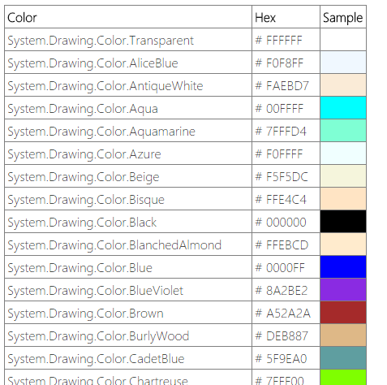

# .Net Color 2 Hex

Currently hosted at [https://colors.binary-stuff.com/](https://colors.binary-stuff.com/).

I often have a [System.Drawing.Color](http://r3f.co/1SrvOrd) value that I don't know the actual color of the color so normally have to do a quick app to get the color. 

This sample app now has all those colors so if can just be referenced =). 

